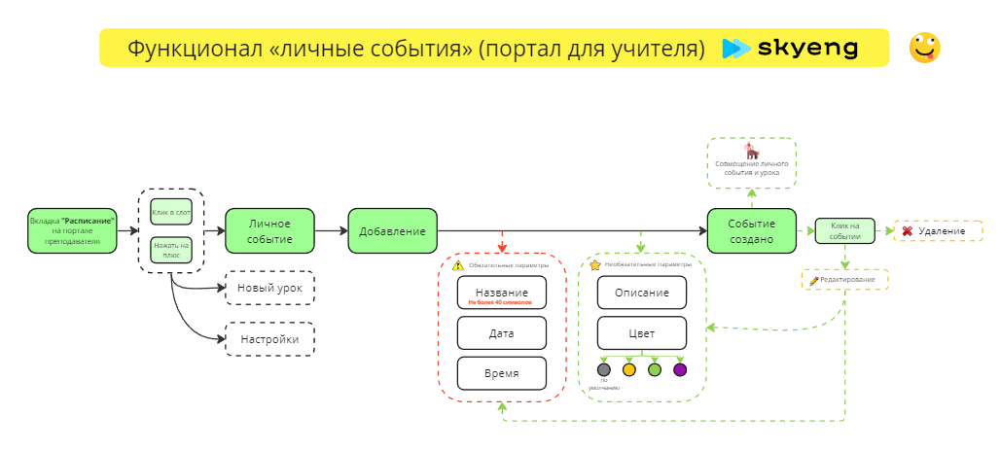

 

# Курсовая работа, 1-й и 2-й курс QA44

# 💡 Тест-план

| Продукт | Функционал "Личные события" | 
|---|---|
| Заказчик |  |
| Сайт | Расписание [teachers.skyeng.ru](https://teachers.skyeng.ru/schedule) |
| Исполнитель | Студент 3-го курса, QA44, Максимов Д. С. |
| Окружение | Операционная система: Windows 10 Pro x64 Версия: 21H2Сборка ОС: 19044.2965 Браузер: Google Chrome Версия 113.0.5672.127 (Официальная сборка), (64 бит) |
| Цель | Проверка готовности продукта |

## 📋 Основные требования:

Главная user-story: 🔗 [требования](https://www.notion.so/6746e543d02c43879de0057cafe196b0?pvs=21).

## 🛠 Виды тестирования:

[Smoke](https://drive.google.com/file/d/1v-HuvkwAJllK_F5Jw6eyp_4kecmb7CXM/view?usp=sharing)

[Функциональное](https://drive.google.com/file/d/1V3JqMpvYMbRb_76Y6eZMkDuC3KuMz6nf/view?usp=sharing) 

[Приемочное](https://drive.google.com/file/d/1RFpUztcsnpH1X3Y5Ii4iCJpr5vmc1j4R/view?usp=sharing)

[Регрессионное](https://drive.google.com/file/d/1qttt5YAJeW0M6ZNPrPi9fxVORmDsZxab/view?usp=sharing)

## 🗒 Тестовая документация

- Тыц
    
    [Untitled Database](%D0%9A%D1%83%D1%80%D1%81%D0%BE%D0%B2%D0%B0%D1%8F%20%D1%80%D0%B0%D0%B1%D0%BE%D1%82%D0%B0,%201-%D0%B8%CC%86%20%D0%B8%202-%D0%B8%CC%86%20%D0%BA%D1%83%D1%80%D1%81%20QA44%20656e4375fa974a29b25765b97b5f5003/Untitled%20Database%2041404ccc80ec43a391f94bbd69d10077.csv)
    

## 🐞 Баг-репорты

🔗 [PDF export from Jira](https://drive.google.com/drive/folders/1BF6coFmrlZ4ZshWnYib36WgjzAggjsQc?usp=sharing)

## ☝️ Тестирование требований

  
👇Тыц

    
| Требование | Вопрос к требованию | Критерий |
| --- | --- | --- |
| Преподаватель может добавить личное событие кликнув в слот | Обводка сетка слотов малозаметна на макете | Недвусмысленность |
| Преподаватель может добавить личное событие нажав на плюс | Плюс на макете не отмечен | Недвусмысленность |
| Для удаления личного события необходимо на него кликнуть и нажать кнопку «Удалить» | Как подтверждается удаление личного события? | Полнота |
| Для того чтобы отредактировать личное событие, необходимо кликнуть на него и нажать «Редактировать». | Как подтверждается редактирование личного события? | Полнота |
| Если событие и урок совпадают по времени, урок отображается всегда выше всего.
Если два события происходят в одно время, отображается выше то, которое было создано последним. | Как происходит отображение событий, назначенных на одно время, если их больше 2-х? | Корректность |

## 🔎 Декомпозиция

[Miro](https://miro.com/app/board/uXjVMC9ROLI=/?share_link_id=277424855356)

## 📚 Отчет о тестировании итогового проекта

  
👇Тыц

Как мы видим из диаграмм и скриншотов тестирования, новый функционал “Личные события“ на [сайте](https://teachers.skyeng.ru/schedule) был протестирован и выявлено несколько багов, которые не оказывают существенного влияния на работу основного функционала. Однако, есть пара довольно неприятных ([QW1-5](https://homework-qa31.atlassian.net/jira/software/c/projects/QW1/issues/QW1-5), [QW1-4](https://homework-qa31.atlassian.net/browse/QW1-4) ), которые рекомендуется исправить до введения нового функционала в продакшн, чтобы улучшить пользовательский опыт и предотвратить возможные проблемы в будущем.

### 📒 Вывод

В целом, результаты тестирования позволяют сделать вывод, что новый функционал готов к введению в продакшн, но необходимо устранить выявленные баги перед его запуском, чтобы обеспечить максимально комфортное использование сайта пользователями.

### 📌 Рекомендации

- Увеличить точность выбора времени до пяти минут при добавлении личного события;
- Расширить возможность выбора даты в прошлом и будущем при добавлении события кликом на кнопке "плюс";
- Добавить отображение поля "Описание" после отмены урока по инициативе ученика;
- Привести поле "Описание", при добавлении личного события, в соответствие с документацией.

    
Дополнительно

    
    Добавить возможность скрытия левого меню, чтобы только расписание отображалось в полный экран.
    
  
    
    Увеличить кратность масштабирования расписания (добавить увеличенный масштаб).
    
  
    
    Убрать прокрутку расписания по горизонтали, т.к. на данный момент она бесполезна.
    
  
  

    Сделать границы сетки расписания более различимыми (контрастными по отношению к фону).
    
   
    
    Вынести чек-бокс "Личные события" из меню с настройками. Также добавить возможность отображения личных событий отдельно от уроков.
    

    
    Добавить в настройки темы отображения сетки расписания.
    
    Добавить палитру RGB в цвета выбора личного события.
    
   
    
    Добавить возможность сохранения цветовых шаблонов для личных событий.

После исправления выявленных багов так же рекомендуется провести дополнительное тестирование до запуска нового функционала в продакшн. Такой подход позволит не только улучшить пользовательский опыт, но и предотвратить возможные проблемы в будущем, связанные с выявленными багами.
